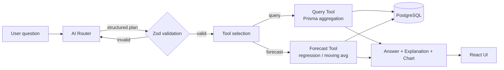

# Spaceship — AI-Powered Logistics Analytics Dashboard

A full-stack analytics application over a logistics dataset, combining a **traditional KPI/chart dashboard** with a **natural-language interface** that answers business questions and forecasts demand. Every answer is **computed from the data** — the AI decides *what* to compute, never *what the number is*.

> **Live demo:** https://spaceship.teknologiasolutions.com
> **API:** https://spaceship-api.teknologiasolutions.com/api (health: `/api/health`)
> **Test credentials:** user `reviewer` / password `gZPiiEEzLFA0` — the login form is pre-filled, so you can just click **Sign in**.

---

## Contents

- [What it does](#what-it-does)
- [Tech stack](#tech-stack)
- [Repository layout](#repository-layout)
- [Architecture & data flow](#architecture--data-flow)
- [How questions are interpreted and tools are selected](#how-questions-are-interpreted-and-tools-are-selected)
- [Data correctness](#data-correctness)
- [Forecasting methodology](#forecasting-methodology)
- [Local setup](#local-setup)
- [Environment variables](#environment-variables)
- [Testing](#testing)
- [Deployment (Coolify)](#deployment-coolify)
- [Assumptions, simplifications & limitations](#assumptions-simplifications--limitations)
- [Future improvements](#future-improvements)
- [AI usage disclosure](#ai-usage-disclosure)

---

## What it does

**Three levels of intelligence over one unified dataset:**

1. **Descriptive** — a dashboard with the five required KPIs (total orders, delivered, delayed, on-time rate, average delivery time) and three charts (order volume over time, delivery performance by status, orders by carrier), with an optional global date filter.
2. **Diagnostic** — a natural-language query interface. Ask _"Which carrier has the highest delay rate?"_ or _"Show delayed orders by week for the last 3 months"_ and get a direct answer, an auto-selected chart, an **explainability panel**, and the underlying data table.
3. **Predictive & prescriptive** — a forecasting tool. Ask _"Predict demand for SKU PAPER-0197 for the next 4 months"_ and get a projection (historical + forecast), an **inventory recommendation**, and a methodology explanation.

---

## Tech stack

| Layer | Choice | Why |
|---|---|---|
| Monorepo | pnpm workspaces + Turborepo | One repo, shared contract package, cached builds |
| Frontend | Vite + React + TypeScript, Recharts | Fast, simple SPA; Recharts for themed charts |
| Backend | NestJS + TypeScript | Structured, modular, clean separation of concerns |
| Database | PostgreSQL + Prisma | Type-safe, parameterized queries — no raw SQL |
| AI | OpenAI (with a deterministic fallback) | Routing/interpretation only; never the source of truth |
| Auth | JWT (single shared login) | Lightweight gate for reviewers |

---

## Repository layout

```
spaceship-assignment/
├─ apps/
│  ├─ api/                 NestJS API
│  │  └─ src/
│  │     ├─ ai/            AI router (OpenAI + deterministic mock) → query plan
│  │     ├─ analytics/     Query Tool: pure aggregation + Prisma where-builder
│  │     ├─ forecast/      Forecasting Tool: linear regression / moving average
│  │     ├─ ask/           Orchestration: route → tool → explainable answer
│  │     ├─ auth/          Shared-login JWT auth + global guard
│  │     ├─ config/        Zod-validated environment
│  │     └─ prisma/        Injectable Prisma client
│  └─ web/                 Vite + React dashboard and NL interface
├─ packages/
│  ├─ shared/              Zod query-plan contract + shared types (used by both apps)
│  └─ db/                  Prisma schema, client, CSV seed
└─ requirements/           Assignment spec + mock dataset
```

## Architecture & data flow

The system follows the spec's expected flow, with a hard boundary between **AI interpretation**, **data computation**, and **business logic**:



**Key design decision — the query plan is the contract.** The AI never emits SQL and never states a number. It emits a **structured, Zod-validated "query plan"** (defined once in `packages/shared`). A deterministic builder turns that plan into **parameterized Prisma queries**. Because the plan is fully typed and range-checked, an out-of-vocabulary metric or a malformed filter is rejected _before_ it can touch the database. The same validated plan doubles as the **explainability payload** returned to the UI — it literally lists the metric, dimensions, and filters that produced the result.

## How questions are interpreted and tools are selected

1. **Grounding.** Before routing, the API loads the dataset's real dimension values (carriers, regions, categories, statuses, date range) and injects them into the model prompt, so free text like _"FedEx"_ or _"last month"_ maps onto valid keys and the actual data window.
2. **Routing.** The AI returns JSON: `{ interpretation, plan }`. The `plan` is a discriminated union on `tool`:
   - **`query`** — a `metric` (e.g. `on_time_rate`, `avg_delivery_days`), an optional `groupBy` dimension (time buckets or categorical), `filters`, `sort`, and `limit`.
   - **`forecast`** — a `target` (units or orders), an optional `sku`/`productCategory`, a `horizonMonths`, and a `method`.
3. **Validation.** The plan is parsed with the shared Zod schema. Anything off-contract throws.
4. **Fallback.** If no `OPENAI_API_KEY` is set — or if the model errors or returns an invalid plan — a **deterministic keyword-based router** produces a valid plan instead, so the app is always usable. The response's `routedBy` field (`openai` | `mock`) is surfaced in the UI.
5. **Computation & presentation.** The selected tool runs the plan; a deterministic rule picks the chart type (scalar → KPI, time series → line, categorical → bar, forecast → dual-line). The answer, chart, explanation, and raw data are returned together.

### Supported query vocabulary

- **Metrics:** `order_count`, `delivered_count`, `delayed_count`, `on_time_rate`, `delay_rate`, `avg_delivery_days`, `total_order_value`, `total_quantity`
- **Dimensions:** `day`, `week`, `month`, `carrier`, `status`, `region`, `destination_city`, `origin_city`, `product_category`, `sku`, `warehouse`, `client_id`
- **Filters:** any of the above categorical values, plus an inclusive `dateFrom`/`dateTo` range

## Data correctness

- The dataset is a single flat CSV (one row per order), so the Prisma schema is a single `Order` model that mirrors it — a deliberate choice over a normalized schema given the read-only, analytics-only use case.
- **On-time rate** = `delivered / (delivered + delayed + exception)`. `in_transit` and `canceled` orders are excluded from the denominator (not yet a completed delivery attempt).
- **Average delivery time** uses a `deliveryDays` value **precomputed at seed time** (`delivery_date − order_date`), so it's a plain column average with no date arithmetic in SQL. It's `null` for orders without a delivery date.
- Filtering is always pushed to the database (`where`); metric computation lives in a **pure, unit-tested module** (`analytics/aggregate.ts`).
- Data is treated as **read-only** — the API exposes no write endpoints.

## Forecasting methodology

- Historical demand is aggregated into **monthly buckets** (gap-filled with zeros).
- Two transparent, reproducible methods: **ordinary least-squares linear regression** (trend line, default) and a **3-month moving average** (flat projection at the recent mean). Negative projections are clamped to zero.
- The **inventory recommendation** is the total projected demand over the horizon plus a **10% safety buffer**.
- Every forecast returns a plain-language methodology note describing the method, the history window, and the buffer.

## Local setup

**Prerequisites:** Node ≥ 22, pnpm 9, and access to a PostgreSQL database.

```bash
# 1. Install
pnpm install

# 2. Configure — copy the template and fill in values
cp .env.example .env
#    set DATABASE_URL, OPENAI_API_KEY (optional), JWT_SECRET, APP_USERNAME, APP_PASSWORD

# 3. Create schema + load the dataset (creates the DB if you have permission)
pnpm db:migrate:dev --name init   # applies migrations
pnpm db:seed                      # loads the 400-row dataset

# 4. Run both apps
pnpm --filter @spaceship/api dev  # API on http://localhost:3000
pnpm --filter @spaceship/web dev  # Web on http://localhost:5173
```

Without an `OPENAI_API_KEY` the app still works fully — the deterministic router handles the documented example questions.

## Environment variables

| Variable | Used by | Description |
|---|---|---|
| `DATABASE_URL` | api, db | PostgreSQL connection string |
| `OPENAI_API_KEY` | api | Optional. Blank → deterministic mock router |
| `OPENAI_MODEL` | api | Defaults to `gpt-4o-mini` |
| `JWT_SECRET` | api | Secret for signing login tokens |
| `APP_USERNAME` / `APP_PASSWORD` | api | The single shared login credential |
| `PORT` | api | API port (default 3000) |
| `FE_ORIGIN` | api | Comma-separated allowed CORS origins |
| `VITE_API_URL` | web | Base URL of the API **including** the `/api` suffix, e.g. `http://localhost:3000/api` (build-time) |
| `RUN_MIGRATIONS` | api | Optional. `true` (default) runs `prisma migrate deploy` on container start |
| `VITE_DEMO_USERNAME` / `VITE_DEMO_PASSWORD` | web | Optional login prefill for reviewers |

Secrets live only in `.env` (gitignored) or in the host's environment — never in the repository.

## Testing

Pure computation logic (aggregation metrics, grouping, forecasting math) is unit-tested with Vitest:

```bash
pnpm --filter @spaceship/api test
```

## Deployment (Coolify)

Two resources, each built from its Dockerfile with **Base Directory = `/`** (the monorepo root is the build context):

- **API** — Dockerfile Location `/apps/api/Dockerfile`. Inject `DATABASE_URL`, `OPENAI_API_KEY`, `JWT_SECRET`, `APP_USERNAME`, `APP_PASSWORD`, and `FE_ORIGIN` (the web URL) as environment variables. The container's entrypoint runs `prisma migrate deploy` on start (idempotent; disable with `RUN_MIGRATIONS=false`). Exposes port `3000`.
- **Web** — Dockerfile Location `/apps/web/Dockerfile`, served by nginx on port `80`. Pass `VITE_API_URL` (the API URL **with `/api`**, e.g. `https://api.your-domain.com/api`), `VITE_DEMO_USERNAME`, and `VITE_DEMO_PASSWORD` as **build args** — Vite bakes them into the static bundle at build time.

The data was seeded once against the shared Postgres instance, so no seeding step is needed on deploy. No secrets are committed; all values are set in Coolify.

## Assumptions, simplifications & limitations

- **In-memory aggregation.** Filtering is done in the database, but metric aggregation runs in application code. This is exact and simple at the dataset's scale (hundreds of rows); a production-scale system would push aggregation into SQL (`GROUP BY` / `date_trunc`) or a warehouse.
- **Single shared login.** Auth is a demo gate, not real user management — one credential, no roles.
- **Relative dates** ("last month", "last 3 months") are resolved against the **dataset's latest order date**, not the wall clock, because the data is historical (2025).
- **Bounded vocabulary.** Queries outside the supported metrics/dimensions (e.g. free-form joins, cohort analysis, arbitrary math) aren't supported — by design, so every answer is validated and computed rather than hallucinated.
- **Forecasting is intentionally basic** (linear/moving-average, monthly granularity). It doesn't model seasonality, promotions, or per-SKU lead times.
- The mock router is a best-effort keyword heuristic, not a substitute for the LLM; it covers the documented examples but won't match the model's flexibility on novel phrasings.

## Future improvements

- Push aggregation into SQL (or materialized views) for scale, and add response caching + a query-history store.
- Richer forecasting (seasonality, confidence intervals, per-SKU lead time) and anomaly/risk detection.
- Multi-user auth with roles; per-client data scoping.
- Streaming responses and clarifying follow-ups for ambiguous questions.
- More chart types and dashboard-level filtering by any dimension.
- E2E tests and CI, plus request-level observability.

## AI usage disclosure

In the spirit of the assignment's note on disclosing AI usage: this project was built by me with the assistance of an AI coding tool (Claude Code) for scaffolding, boilerplate, and drafting. All architecture and design decisions — the query-plan contract, the AI-as-router boundary, the data model, and the correctness rules — were directed and reviewed by me, and the computation logic is covered by unit tests I verified. Separately, at **runtime**, the application uses the OpenAI API strictly as a **routing/interpretation layer** that emits a validated plan; it never generates the analytical numbers itself.
